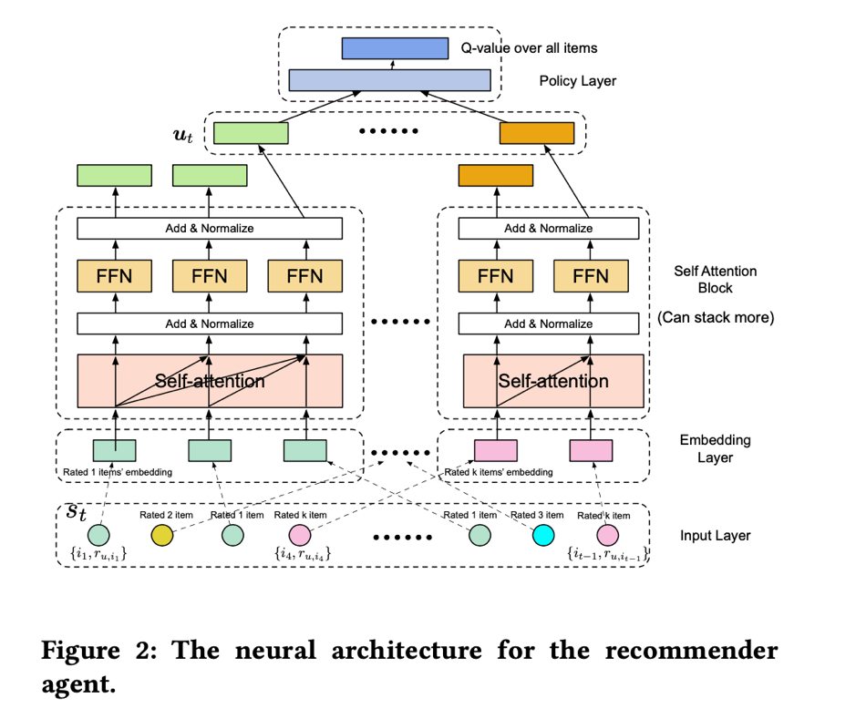

Neural Interactive Collaborative Filtering ( SIGIR 2020)
============

# NICF:

   NICF_code is the code for our paper "[Neural Interactive Collaborative Filtering](https://dl.acm.org/doi/pdf/10.1145/3397271.3401181)", which is published in SIGIR 2020. 

   The code is also available at https://github.com/zoulixin93/NICF.



## Citation:

Please cite the following paper if you use the code in any way.

```
@inproceedings{10.1145/3397271.3401181,
author = {Zou, Lixin and Xia, Long and Gu, Yulong and Zhao, Xiangyu and Liu, Weidong and Huang, Jimmy Xiangji and Yin, Dawei},
title = {Neural Interactive Collaborative Filtering},
year = {2020},
isbn = {9781450380164},
publisher = {Association for Computing Machinery},
address = {New York, NY, USA},
url = {https://doi.org/10.1145/3397271.3401181},
doi = {10.1145/3397271.3401181},
booktitle = {Proceedings of the 43rd International ACM SIGIR Conference on Research and Development in Information Retrieval},
pages = {749–758},
numpages = {10},
keywords = {recommender systems, cold start, meta-learning, reinforcement learning},
location = {Virtual Event, China},
series = {SIGIR '20}
}
```


